# 使用 Vercel 反代 openai （图文教程）

- [使用 Vercel 反代 openai （图文教程）](#使用-vercel-反代-openai-图文教程)
  - [简介](#简介)
  - [使用方法](#使用方法)
  - [要求](#要求)
  - [示例](#示例)
  - [部署](#部署)

## 简介

国内只是墙了 vercel 本身的域名，但是自定义域名没有墙，因此做了代理并绑定域名之后就可以用自己的域名在国内直连 openai api 了。

理论上也可以代理其他被墙的站点。

## 使用方法

- 访问 openai api 时，将 "api.openai.com" 换成你的自定义域名，例如

    ```javascript
    const host = 'YOUR DOMAIN'
    const url = `https://${host}/v1/chat/completions`
    ```

- 可参考 [OPENAI API 官方文档](https://platform.openai.com/docs/api-reference/chat)

  [官方文档中文翻译](https://linlin00.feishu.cn/docx/Fupxd8fIioGToIxv6Tacz4XbnBf)（部分过时，仅供参考）

- 在其他 chatgpt 项目中，可以将变量 "OPENAI_API_BASE_URL" 设置为你的域名

## 要求

- Openai API KEY, 形如 "sk-xxxxxxxx" 的字符串

- 一个域名（无需备案），没有的话可以在阿里云上买一个几块钱一年的
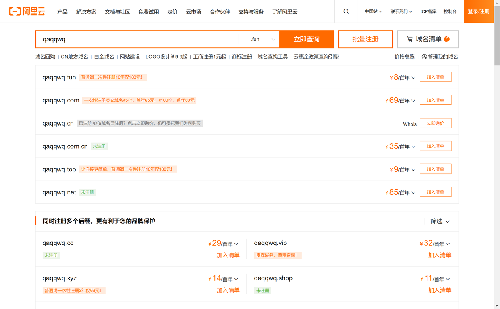

## 示例

<details><summary>Postman</summary>
<p>

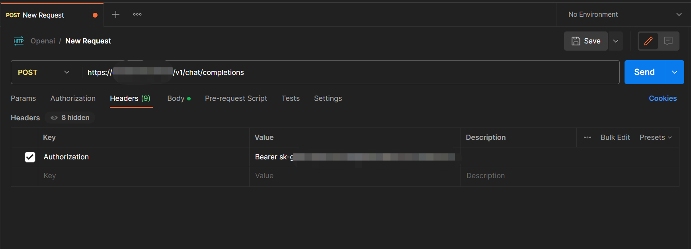
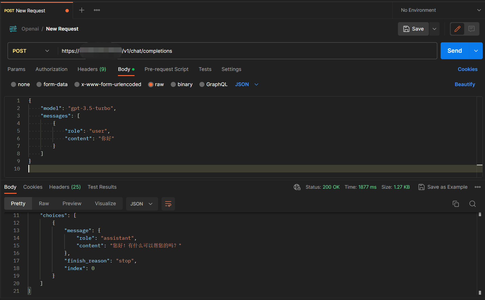

</p>
</details>

以下代码均由 Postman 生成

<details><summary>cURL</summary>
<p>

```bash
curl --location 'https://YOUR DOMAIN（改成你的域名）/v1/chat/completions' \

--header 'Authorization: Bearer sk-xxxxxxxxxxxxx（改成你的APIKEY）' \
--header 'Content-Type: application/json' \
--data '{
    "model": "gpt-3.5-turbo",
    "messages": [
        {
            "role": "user",
            "content": "你好"
        }
    ]
}
'

```

</p>
</details>

<details><summary>Python - Requests</summary>
<p>

```python
import requests
import json

url = "https://YOUR DOMAIN（改成你的域名）/v1/chat/completions"

payload = json.dumps({
  "model": "gpt-3.5-turbo",
  "messages": [
    {
      "role": "user",
      "content": "你好"
    }
  ]
})
headers = {
  'Authorization': 'Bearer sk-xxxxxxxxxxxxx（改成你的APIKEY）',
  'Content-Type': 'application/json'
}

response = requests.request("POST", url, headers=headers, data=payload)

print(response.text)
```

</p>
</details>

<details><summary>NodeJs - Axios</summary>
<p>

```javascript
const axios = require('axios');
let data = JSON.stringify({
  "model": "gpt-3.5-turbo",
  "messages": [
    {
      "role": "user",
      "content": "你好"
    }
  ]
});

let config = {
  method: 'post',
  maxBodyLength: Infinity,
  url: 'https://YOUR DOMAIN（改成你的域名）/v1/chat/completions',
  headers: { 
    'Authorization': 'Bearer sk-xxxxxxxxxxxxx（改成你的APIKEY）', 
    'Content-Type': 'application/json'
  },
  data : data
};

axios.request(config)
.then((response) => {
  console.log(JSON.stringify(response.data));
})
.catch((error) => {
  console.log(error);
});
```

</p>
</details>

<details><summary>JavaScript - Fetch</summary>
<p>

```javascript
var myHeaders = new Headers();
myHeaders.append("Authorization", "Bearer sk-xxxxxxxxxxxxx（改成你的APIKEY）");
myHeaders.append("Content-Type", "application/json");

var raw = JSON.stringify({
  "model": "gpt-3.5-turbo",
  "messages": [
    {
      "role": "user",
      "content": "你好"
    }
  ]
});

var requestOptions = {
  method: 'POST',
  headers: myHeaders,
  body: raw,
  redirect: 'follow'
};

fetch("https://YOUR DOMAIN（改成你的域名）/v1/chat/completions", requestOptions)
  .then(response => response.text())
  .then(result => console.log(result))
  .catch(error => console.log('error', error));
 ```

</p>
</details>

<details><summary>飞书机器人</summary>
<p>

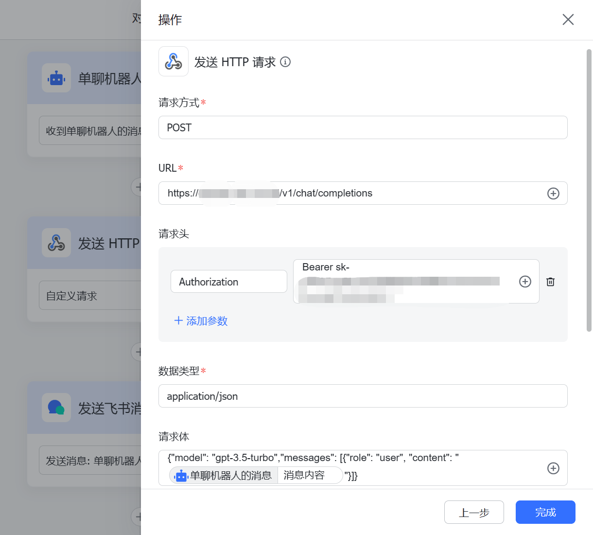

</p>
</details>

## 部署

1. 点击一键部署按钮

   [](https://vercel.com/new/clone?repository-url=https%3A%2F%2Fgithub.com%2FLinLin00000000%2Fvercel-proxy-openai&project-name=vercel-proxy-openai&repository-name=vercel-proxy-openai&root-directory=src)

2. 用 Github 登录 Vercel，没有 Github 账户的去注册一个，网上很多教程就不展开了
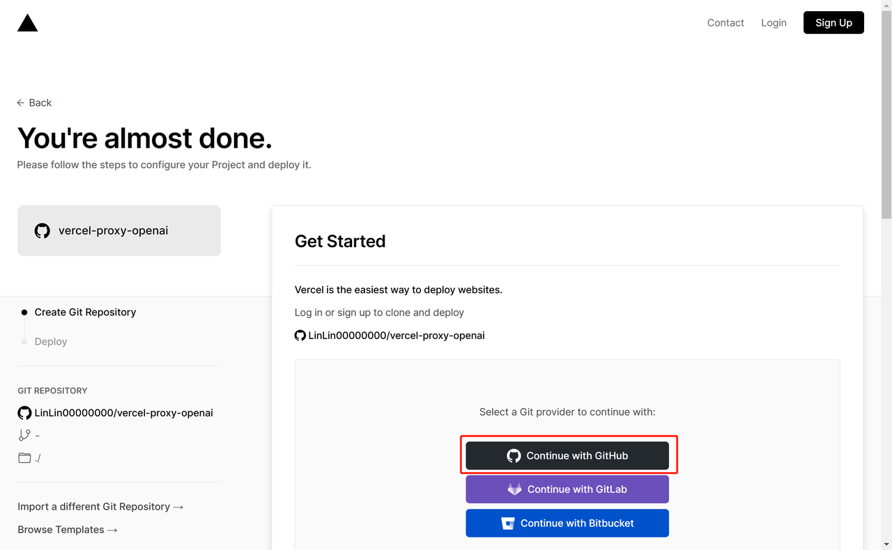
3. 登录之后点击 Create 按钮
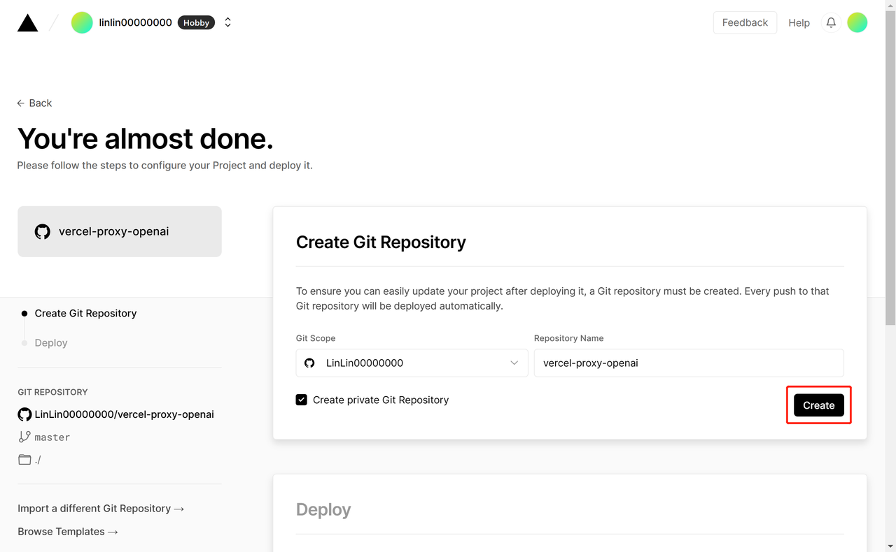
4. 接着等十几秒钟就创建好项目了，接下来进入仪表盘
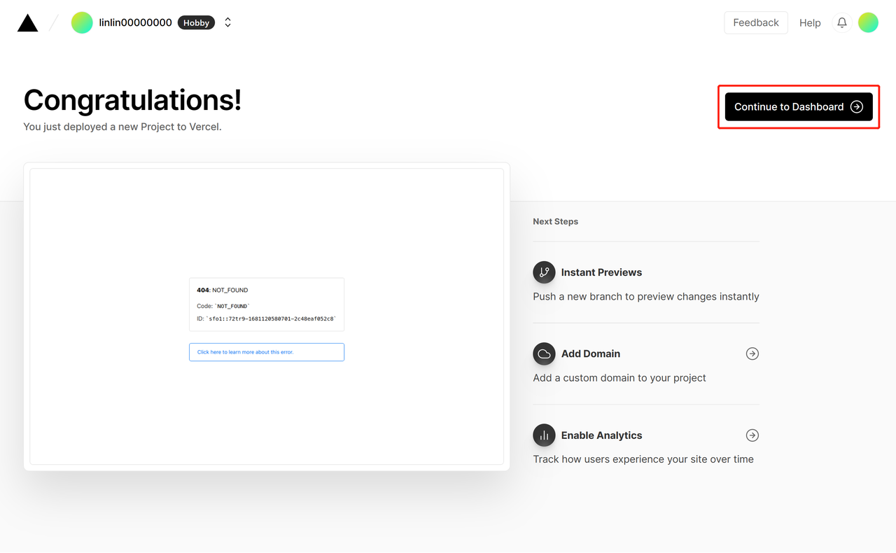
5. 进入到项目里之后，依次点击 Settings -> Domains，然后添加你的域名。添加的域名类型有两种，一种是一级域名(xxxx.com)和二级域名(openai.xxxx.com)，我个人推荐使用二级域名，因为一级域名一般用来做网站展示用，只能有一个，而二级域名可以有无限个（只要你有一个域名就可以自己创建无限个二级域名）
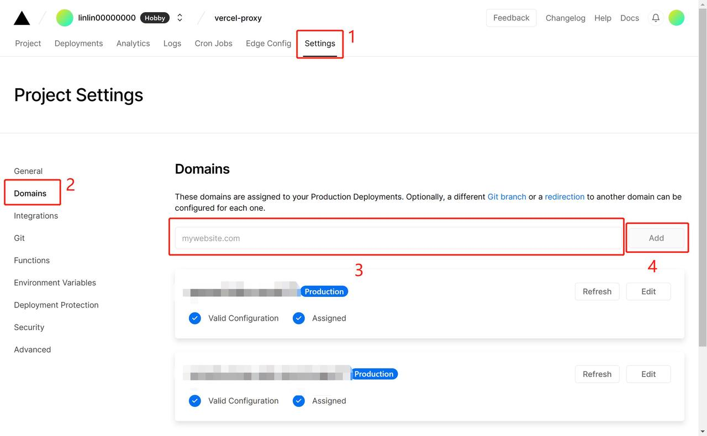
6. 添加域名有三种方式，这里我们选第三种，因为简单
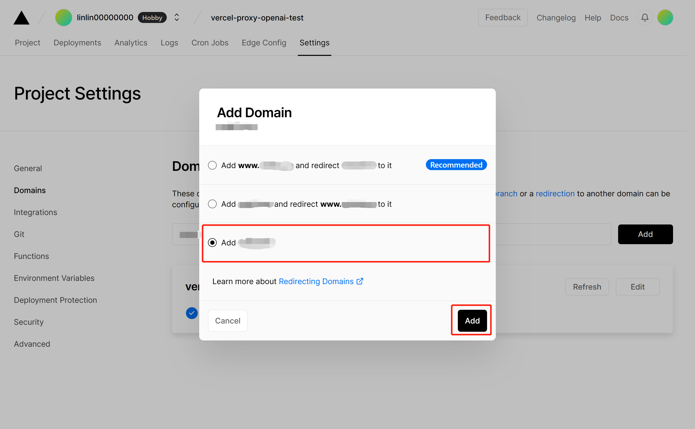
7. 接下来会分两种情况，分为一级域名和二级域名，都有教程，以阿里云为例（其他厂商也是差不多的配置，很简单的）

   1. 一级域名

      添加一级域名后 Vercel 会提示让你添加 DNS 解析记录
      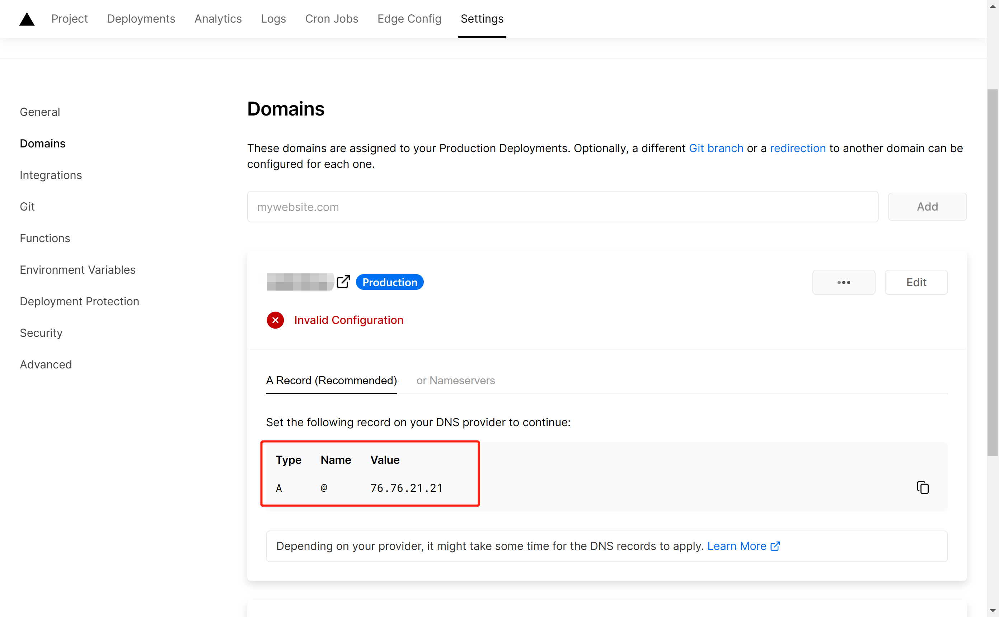
      在阿里云域名解析的解析设置里点击 添加记录，按照 Vercel 的提示配置好图中三个选项，点击确认
      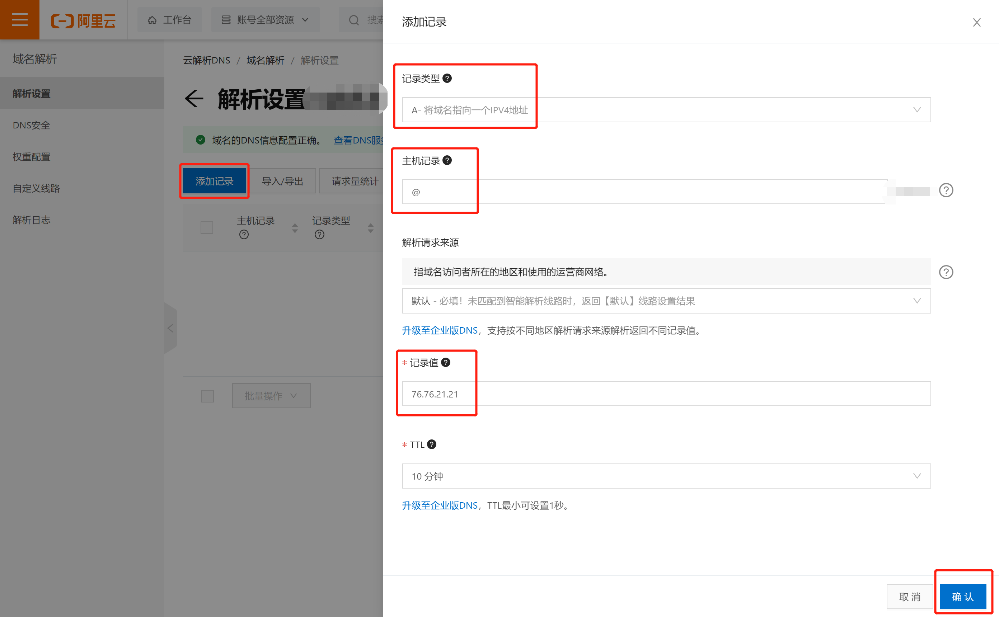
      回 Vercel 点击 Refresh 按钮，出现下图所示的情况就表明配置完成了
      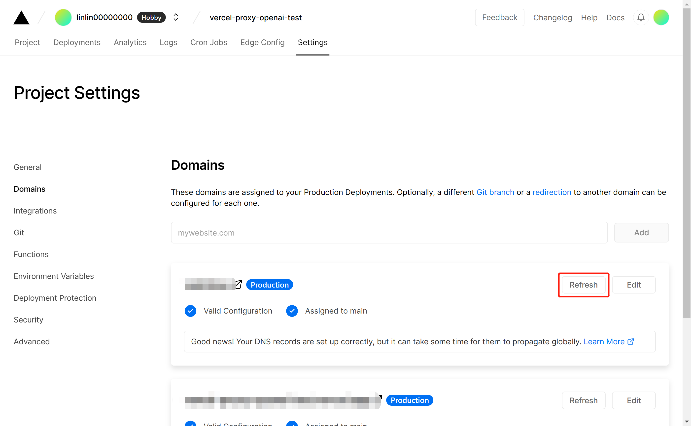
   2. 二级域名（以 openai 主机记录为例，可以改成自己喜欢的）

      添加二级域名后 Vercel 会提示让你添加 DNS 解析记录
      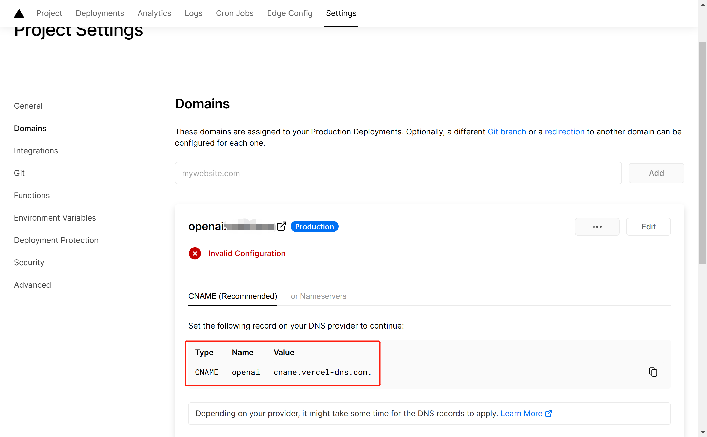
      在阿里云域名解析的解析设置里点击 添加记录，按照 Vercel 的提示配置好图中三个选项，点击确认
      
      回 Vercel 点击 Refresh 按钮，出现下图所示的情况就表明配置完成了
      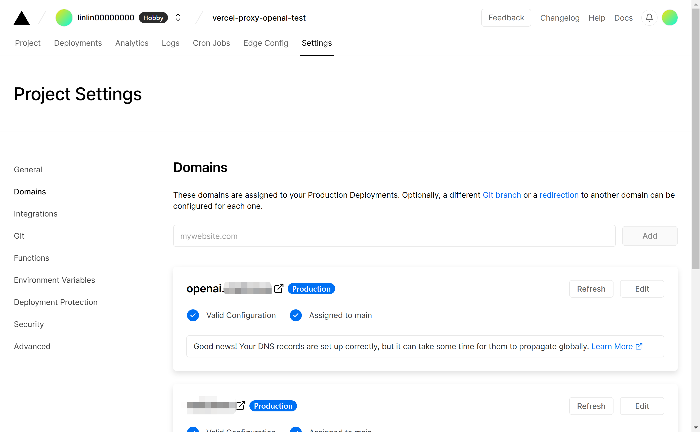

🎉接下来就可以愉快地使用 openai api 啦~

有问题可以 [在此](https://github.com/LinLin00000000/vercel-proxy-openai/issues) 留言
